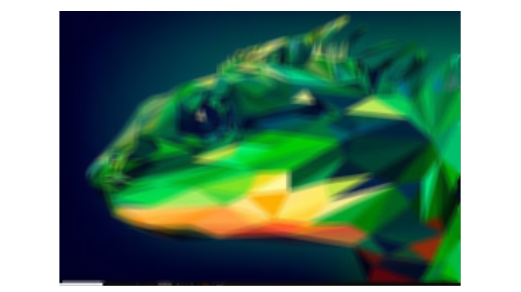
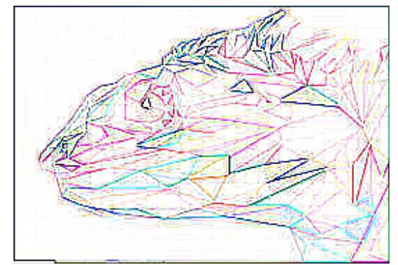
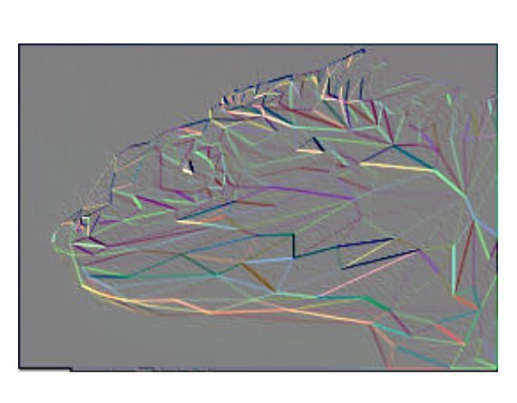
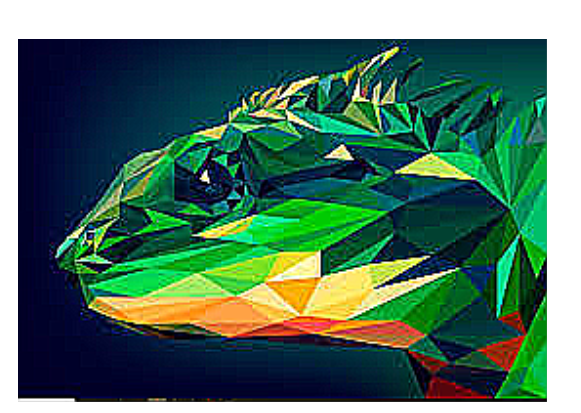
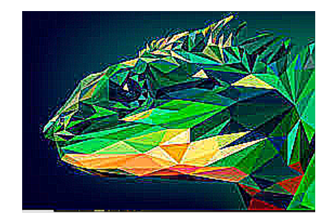

# Python-Basic-Code
👽 Basic logical program in python includes code, games,etc.

🐍 Python Program to understand the concept and logic of it.

✴️  PIL is the Python Imaging 🖼️ Library which provides the python interpreter with image editing capabilities.

The ImageFilter module contains definitions for a pre-defined set of filters, which can be be used with the Image.filter() method.

1️⃣ BLUR

2️⃣ CONTOUR

3️⃣ EMBOSS

🍀 ENHANCE

5️⃣ ENHANCE MORE

